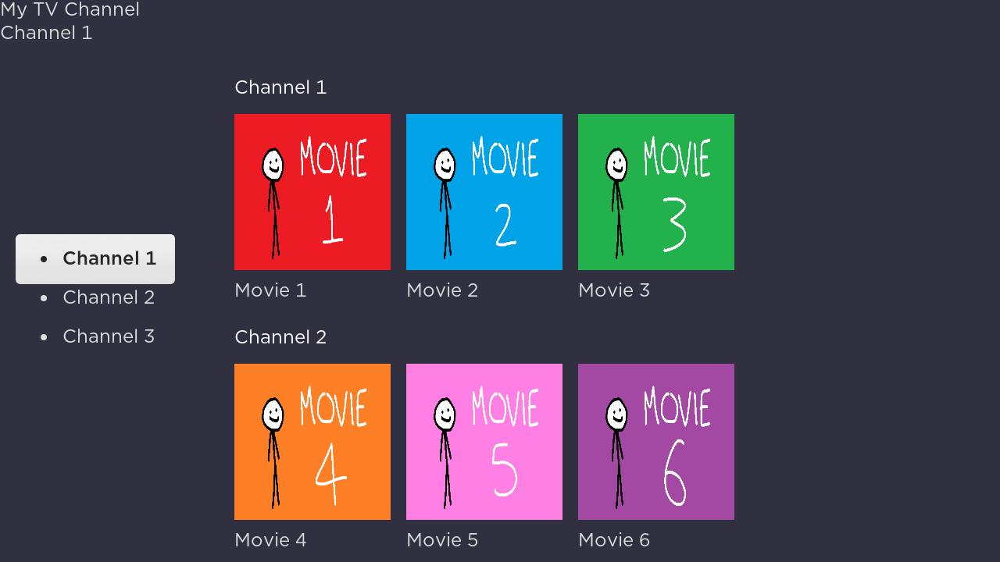

When the user presses Right on the button group, focus switches to the row list and the screen subtitle updates. When user selects a row list item, a video plays. When the user presses back. The user is returned to the home screen.
 
 
 
 
 
