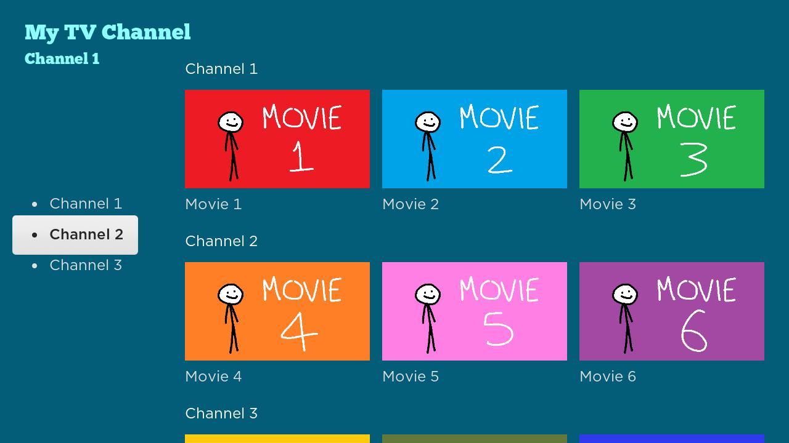

# My TV
An app for watching one of a selection of videos.
# Features
* Focus on a row by focusing on a button then pressing `Right`.
* Focus back to the button group by pressing `Left` while focused on the first item in the row list.
* "Channel" subtitle updates when the focused row changes.
* Play a video by selecting a row item. The video title matches the label selected row item.
* Navigate back to the main screen from the video screen by presing `Back`.
# Screenshots
Choose a button. 
 
Press `Right` and the respective row will be focused and the "channel" subtitle will update. 
 
Subtitle also updates when changing focused row manually. 
 
Video plays with respective title of selected row item. 
 
Press `Back` and the video will be stopped and hidden; the app returns to the main screen. 
 
Press `Left` to switch focus from the first item of the row list to the button group. 
 